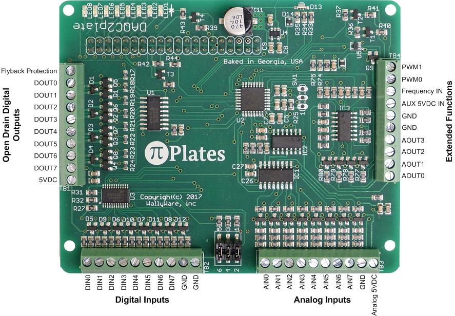

# DAQC2Plate

*Julia package to communicate with the DAQC2Plate*

The [DAQC2Plate](https://pi-plates.com/) is manufactured by pi-plates.com. Stated on their site it is an "advanced data acquisition and control board combines eight 16-bit A/D converters with four 12-bit true D/A controllers and eight high current digital outputs. This board includes a number of free applications including a digital oscilloscope and a function generator."

This package wraps the manufacturers python library and makes it available as julia functions. See the pi-plates documentation and test function in the test folder for basic IO. 

Author: Markus Petters (mdpetter@ncsu.edu)
